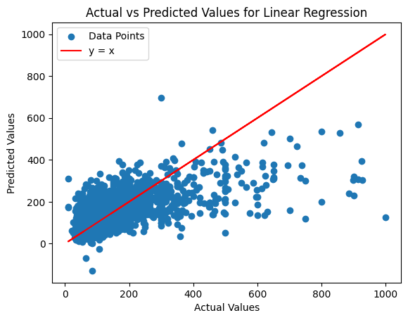

# New York AirBnB Price Predictions
Since the number of listings hit their peak just before the pandemic, prospective hosts have been seeing fewer and fewer bookings as the market has been oversaturated. Combined with the slowing economy, hosts have had a more difficult time pricing their units. Our model aims to help inform these homeowners’ decisions by analyzing the overall market and deciding what a fair price for their unit would be to base their choice off of. 

---

For this project, we used the `New York Airbnb Open Data 2024` dataset by Vrinda Kallu, available [here](https://www.kaggle.com/datasets/vrindakallu/new-york-dataset/data).

We began our data exploration by loading both a pairlot and a heatmap for our data to determine any correlations amongst the data. By viewing the data in these forms we could clearly see there appear to be a few outliers on the plots for price where we can clearly see a single point distant from the rest of the data. Also, we looked at the number of null values, unique columns, and the data types for each column before conducting data cleaning.

After conducting our initial data exploration, we first decided to drop some features that are unrelated to our question, such as `id`, `name`, `host_id`, `host_name`, `latitude`, and `longitude`. We found quite a few of the features are object values as they are mixtures of strings and numerical values in the features: ratings and baths. In these features we found string values indicating these listings had no values there. We handled this by dropping the not specified values for the baths as throughout exploration we found there were only 13 listings where the number of baths was marked as `Not Specified`. On the other hand we found that 1815 of the listings had been marked as having `No Rating` or as `New` indicating it has no rating yet. Thus, we decided to perform median imputation instead of mean imputation since there was an extremely large value of outlier. Additionally to handle the categorical features we decided to one hot encode room_type and neighbourhood_group in our initial preprocessing. We also found through our exploration that the `bedrooms` feature has a mixture of numerical values and `Studio`. In order to handle this data we set all instances of `Studio` to 0 in the `bedrooms` column and made a one hot encoding column for the `Studio` values. At some point, we plan on normalizing and standardizing the data to see the importance of predicted values using weights by making it easier to compare and analyze.

## [Model 1: Linear Regression](https://colab.research.google.com/drive/1jjwC8OQ4t2foMpVOL1rNyTsa6Zegyr1H#scrollTo=x0l9IybfOdcb )
Looking at the predictive error for our linear regression model, the training, validation, and testing MSE were all very high (10760, 9347, 10208). This tells us that in the fitting graph, our model fits on the leftmost side where we have a very simple model that is underfitting the data. We also experimented with a [polynomial regression](https://colab.research.google.com/drive/1jjwC8OQ4t2foMpVOL1rNyTsa6Zegyr1H#scrollTo=vlLf2gjQPPag) model with a degree of 4, yet our MSE was still high for both the training and testing MSE, with the testing MSE being significantly higher than the training (7350 versus 1.74e22). This model would fit on the right side of the fitting graph (overfitting), despite the high training MSE. 

For our first model we choose to use Linear Regression. Our linear regression model performed poorly. With it being our most simple model, there is little we can do to improve the mean squared error (MSE) of the model. After initially running the model and seeing an extremely high MSE, we reevaluated our feature data to filter any outliers, which were any AirBNB listings with a minimum price over $1000 per night. After rerunning the linear regression model on the data excluding the outliers, the MSE improved although was still performing quite poorly. This seems to suggest that there are little to no linear relationships between any of the numerical features and price. To improve this model, we could plot some of the feature distributions to see if there are outliers in them and drop these rows as well. However, since we have found there is not a linear relationship between the features we selected and our target `price`, the best step moving forward would be to test out an entirely different model. 

One possible model we can implement next is a neural network. Trying several hidden layers with different numbers of units (nodes) per layer and different kinds of activation functions would help find the best model for predicting the price, which would be more  accurate than the current linear, polynomial, or logistic regression models. 
Another model that we can implement is a support vector machine. We observed that our MSE was extremely high for a linear regression model which is a relatively simple model. A more complex model like SVM will try to find a hyperplane to model the distribution which could potentially be more accurate than a simple linear regression.

## [Model 2: Sequential Neural Network](https://colab.research.google.com/drive/1jjwC8OQ4t2foMpVOL1rNyTsa6Zegyr1H#scrollTo=qA7ON3QSub6I)
For our second model we chose to use a Sequential Neural Network. For this model, our existing dataframe and columns were sufficient, and we are continuing to use mean squared error as our loss function. Similar to our first model, our second model did not perform as well with a MSE for our training, testing, and validation data being: 10512, 11065, 10786. With those MSE's in mind, we observe our model is fairly consistent in performance and is on the left side of the fitting graph similar to our first model. This means our model was still fairly simple and underfitted our data.

In this model, when we did not perform any hyperparameter tuning and any feature expansion with  K-fold cross-validation, with 10 folds repeated 5 times. The results were still similar to our first model in that the MSE was roughly around 10000. After conducting hyperparameter tuning to find the optimal number of units, optimization function, and learning rate. The results of this were significantly worse than the previous neural net we used. We found the MSE from our best model determined by hyperparameter tuning was around 30000.

One model that we considered using is Random Forest Regressor because our data has a lot of dimensionality and the relationship between our feature variables and our target variable is not linear. Random Forest Regressors are much more complex than a simple model like Linear Regression and our Sequential Neural Network and are more likely to handle our complex data better.

Our second model, the Sequential Neural Network performed similarly to our first model, Linear Regression. This is likely due to the simplicity of the model as although our model had more depth and layers to it, it is fairly simple compared to other neural network models. Somethings that can be done to possibly improve our model is to do some feature expansion and hyper parameter tuning as there were many activation functions and layers that we could have experimented with.

## [Model 3: Random Forest Regression](https://colab.research.google.com/drive/1jjwC8OQ4t2foMpVOL1rNyTsa6Zegyr1H#scrollTo=GV66h11LR_tT)
For our final model we decided to use a Random Forest Regressor. Similar to the other models, we did not need to alter our data further and continued using the same dataframe and loss function (MSE). Unlike our first two models, our third model performed better than those two in training, testing, and validation MSE, with a score of 1510, 8158, 9327. We observe that our model is overfitting because the training score is much lower compared to the testing score and validation score. In other words, our model would lie on the right side of the fitting graph, being a complex and overfitted graph.

In this model, we did not perform any hyper parameter tuning and any feature expansion. However, we did have K-fold cross validaiton, with 10 folds repeated 5 times. The results were 9327.

Our third model, the Random Forest Regression performed much better compared to our first two models, Sequential Neural Network and Linear Regression. This is likely due to how the model is much more complex than our first two models and thus able to better handle our data. Somethings that can be done to possibly improve our model is to do some feature expansion and hyper parameter tuning in order to make our model overfit our data less and make the scores between training, testing, and validation more consistent and closer to 0.

---

## Final Notebook:

## Final Writeup
### Introduction
When traveling to new areas, people use Airbnb as one of their main methods to find accommodation. However, identifying and setting good and bad prices of Airbnbs in certain areas can be difficult. Therefore, the goal of our CSE 151A Group Project is to predict the price per night of Airbnb listings in New York, which is able to help both the travelers and the homeowners to set and find an appropriate price for Airbnb’s.

### Dataset
In order to predict the price per night of an Airbnb in New York, we will train three models on data from the `New York Airbnb Open Data 2024` dataset. This dataset includes various metrics from Airbnbs in New York City including neighborhood, room type, ratings, and location data. For this particular problem, we will be predicting a continuous value, price, based on various Airbnb features. The features included in our models are:
- `minimum_nights`: the minimum amount of nights a customer must stay at the Airbnb
- `number_of_reviews`: the total number of times the Airbnb has been reviewed
- `reviews_per_month`: the amount of times the Airbnb gets reviewed each month
- `calculated_host_listings_count`: the number of Airbnb listings that a host owns
- `rating`: the rating that a listing has, from 1 star to 5 stars
- `bedrooms`: the number of bedrooms available
- `beds`: the number of beds available
- `baths`: the number of bathrooms in the Airbnb
- `neighbourhood_group`: the name of the borough of New York that the listing is in
- `room_type`: the type of property that the listing is, such as a private room, apartment, house, etc.

### Methods
#### Data Exploration
In the data exploration process, we looked at the relationships between each feature to give ourselves a vague idea of which features can be closely related to price and which features cannot. We explored the data by looking at the heatmap, pairplot, and type of data each feature had. We identified the categorical and numerical features and how they would help in predicting Airbnb prices. We also found that numerous features weren’t ideal in predicting Airbnb prices, such as `id`, `host_id`, `host_name`, `last_review`, etc. Additionally, we found Airbnb-price outliers that price values at $100,000. After this process, we initially decided that the three models that we would use are regression, Decision Trees, and K-Nearest Neighbors. However, the last two models would be changes to Neural Network and Random Forest because we realized that those are more appropriate models for the price prediction.

#### Data Preprocessing
After exploring our raw data, several of the features required cleaning. First, we examined the ‘ratings’ columns. For any Airbnbs that had no ratings, we imputed those values with the median rating. Next, we one-hot encoded both the `neighborhood_group` column and the `room_type` column in order to represent these distinct categorical features. Additionally, we created a separate column for any studios and removed them from the `bedroom` column, reasoning that since studios don't have a bedroom, they are their own unique situation. We also eliminated any Airbnb listings with a price per night of over $1000. Finally, we normalized all of our features using a MinMaxScaler which also preserved the shape of our original distribution.

#### Model 1: Regression
- [Linear Regression](https://colab.research.google.com/drive/1jjwC8OQ4t2foMpVOL1rNyTsa6Zegyr1H#scrollTo=x0l9IybfOdcb)
- [Polynomial Regression](https://colab.research.google.com/drive/1jjwC8OQ4t2foMpVOL1rNyTsa6Zegyr1H#scrollTo=vlLf2gjQPPag)
For the regression models, we used all of the chosen features to predict the Airbnb prices. We performed a linear regression on the dataset as well as polynomial regressions with degrees ranging from 2 - 4. However, ultimately we decided to only include degree 4 into the notebook. To look at the accuracy of our regression models, we used mean-squared error (MSE).

#### [Model 2: Neural Networks](https://colab.research.google.com/drive/1jjwC8OQ4t2foMpVOL1rNyTsa6Zegyr1H#scrollTo=qA7ON3QSub6I)
We created a `Sequential` model and added 6 dense layers. For the input layer, we used 128 neurons (units) with linear activation function. We added 4 more layers with 64, 32, 16, and 8 neurons (units) respectively with linear activation function. Finally, we added the output layer with 1 neuron (units). After building a model, we compiled this model with `adam` optimizer, which is well known for gradient-based optimization, and used mean squared error for the loss function.

#### [Model 3: Random Forest](https://colab.research.google.com/drive/1jjwC8OQ4t2foMpVOL1rNyTsa6Zegyr1H#scrollTo=GV66h11LR_tT)
We initialized RandomForestRegressor with the following parameters - `n_estimators=100`, `random_state=0`, `oob_score=True`. We decided to use 100 trees in the random forest, and used 0 for the random state in order to make the results reproducible. We also used `oob_score = True` parameter to allow using out-of-bag samples to estimate the score of the model.

### Results
- Model 1: Regression
  - Linear Regression
    - Training MSE:  10760.671655411572
    - Validation MSE: 9347.664355231143
    - Testing MSE:  10208.994525547445

  - Polynomial Regression
    - Degree = 4, Training MSE: 7513.000506446608
    - Degree = 4, Testing MSE: 4.496952953456398e+19
    - Validation MSE: 2426.8657522951507

- Model 2: Neural Networks
  - Train MSE: 10895.838031603987
  - Validation MSE: 10788.70052483614
  - Test MSE: 10348.186649912388

- Model 3: Random Forest
  - Train MSE: 1510.2902779701878
  - Validation MSE: 9327.000612329275
  - Test MSE: 8158.552072786882

### Discussion
Our best performing model was our Random Forest regressor. As expected, our simpler regression models, linear and polynomial regression, performed very poorly. However, we expected the Neural Networks to achieve a better performance but they resulted in similar MSEs to the simple models.

For linear and polynomial regressions, we included all features in our model, including the categorical features, which could be a potential reason why our regression models performed so poorly. The high training and testing MSEs indicated that these models were not a good fit to capture the underlying intricacies in our data. For linear regression, the validation MSE was slightly lower than the training and testing MSE, suggesting that the model might generalize better to unseen data than to the training data. However, our polynomial regression model had the opposite problem of severely overfitting. The testing MSE was astronomically higher than the training MSE.

Since neural networks are powerful, nonlinear models, we expected them to perform well on our task. However, the results were not as expected. Both the training and testing MSE values were quite high, suggesting that the neural network model might suffer from overfitting or insufficient training. Further hyperparameter tuning and possibly increasing the complexity of the network architecture might improve its performance.

The Random Forest model demonstrated the best performance among the models tested. The training MSE was significantly lower than the testing MSE, indicating overfitting. However, the testing MSE was relatively low compared to other models, suggesting that random forest effectively captured the underlying patterns in the data and generalized well to unseen data.

### Conclusion
In this group project, we used Linear and Polynomial Regression, Neural Networks, and Random Forest to predict the New York Airbnb prices. We think that this prediction can be very useful to both travelers and house owners to identify the most appropriate prices given their house’s/apartment’s basic information.

For the data we had 10 features, including 2 categorical features and 8 numerical features. However, seeing that we have a relatively high MSE for all three models, we can question if all of the features are useful to predict the Airbnb prices. We can ask the question if any of the features in the dataset provide extra noise that make the prediction less accurate. Therefore, next time it would be useful to add an additional layer of data preprocessing where we add a criteria to see which features would be the most important factors in setting an Airbnb price. We could determine if we need to add more features or eliminate redundant/unnecessary features.

Additionally, as we were learning new models as the project continued, we gained more knowledge on which models were more appropriate. This led us to change the models that we had to use midway through the project, which caused a shift in direction and expectation in the project. Next time, since we know which models are the best candidates to use, we’ll be able to implement quicker, and we can use the additional time to make our models produce more accurate results.

### Collaboration
Christopher Han
- **Title**: Virtuoso
- **Contributions**: Abstract writeup, testing + experimenting + giving feedback for model 1, final writeup

Desmond Vu
- **Title**: Adventurer
- **Contributions**: Contributed with the writing portions for milestone 4 and 5

Hannah Coates
- **Title**: Defender
- **Contributions**: Assisted in implementing model 2 (Neural Network), helped with write-ups for both models and preprocessing, and helped organize meetings

Jenny Mar
- **Title**: Consul
- **Contributions**: Implemented Models 1 (Linear Regression) and 2 (Neural Network), developed pre-processing plots, and helped organize meeting times

Justin Lu
- **Title**: Mediator 
- **Contributions**: Organized meetings & facilitate decisions, enhanced/edited README and github, wrote portions of data preprocessing

Kyla Park
- **Title**: Logistician
- **Contributions**: Contributed with writing milestone write ups and final write up

Megan Huynh
- **Title**: Campaigner
- **Contributions**: Write the reports and initialize code notebooks with to-dos

Nitya Pillai
- **Title**: Defender
- **Contributions**: Assisted in implementing model 1 and implemented model 2, helped with writeups for both models and helped organize meetings

Rachel Chau
- **Title**: Advocate
- **Contributions**: Helped with building and evaluating Models 1 and 3. Wrote up portions of milestone write ups and final writeup
